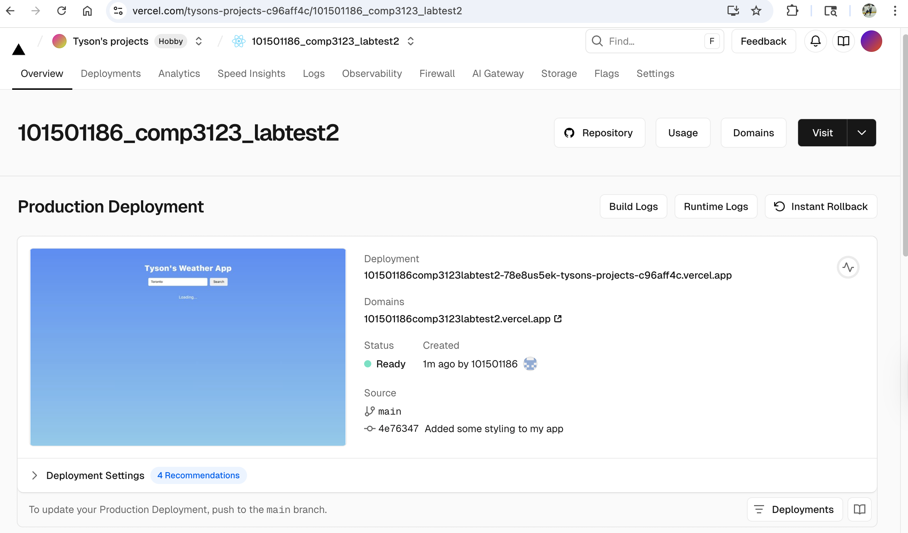
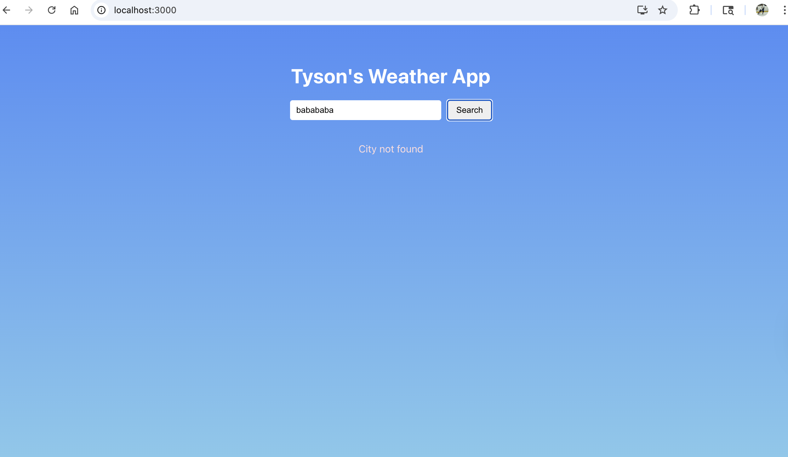

# 101501186_comp3123_labtest2 - React Weather App

This weather app that I created is a simple React weather app that basically shows the current
weather for any city using a public API. THe user just needs to simply type the name of the 
city inside the text box to view: The city name + first 2 letters of the country, the current temperature,
a small weather description, and the weather icon. 

# Project Details

Student Name: Tyson Ward-Dicks
Student ID: 101501185
Course: COMP3123
Test: Lab Test 2

Steps to run app:
- go to the root folder
- in terminal apply: npm start
- app will load at: http://localhost:3000

# Screenshots

# Vercel

Live demo: 
https://101501186comp3123labtest2.vercel.app/

# Features

- Search Weather by city name
- Shows: City + country, current temperature (degrees celcius), weather description, weather icon
- Loding state while the data is being fetched
- Error message if the city has not been found or a problem with the API
- Built with React function compnents, state, props, and hooks

# Technologies Used

- React
- JavaScript (ES6+)
- CSS for the styling
- fetch API for http request
- OpenWeatherMap API

# API info

Primary API: http://api.openweathermap.org/data/2.5/weather?q=Toronto&appid=fcf31da4ff2e64929b6de913e1e8d6a5